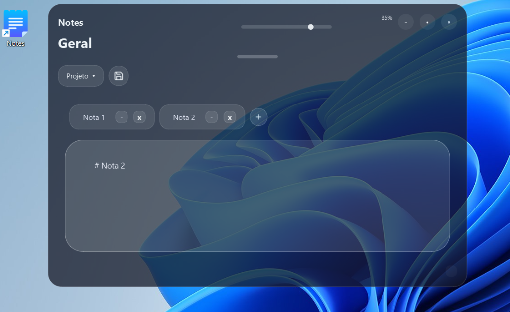

# 📝 Notes - Aplicativo de Notas Moderno & Transparente (v1.0.0)

Um aplicativo de anotações elegante, rápido e moderno para Windows, desenvolvido em **Python** e **PySide6**. Possui design *Glassmorphic* translúcido, salvamento automático em tempo real, navegação por abas dinâmicas, suporte a múltiplos idiomas (**PT-BR / EN**) e gerenciamento de projetos em Markdown (`.md`).



---

## ✨ Recursos Principais

- 💎 **Design Glassmorphic Translúcido**: Janela sem bordas padrão do SO, com slider para ajustar a opacidade em tempo real.
- 🏷️ **Versão & Idioma Embutidos (`v1.0.0`)**: Botão `🌐 PT` / `🌐 EN` no topo para alternar instantaneamente entre Português e Inglês.
- ⚡ **Criação Rápida de Notas (`+`)**: Crie uma nova nota instantaneamente ao lado das abas sem janelas de confirmação.
- 🔄 **Auto-Salvamento em Tempo Real**: Cada caractere digitado é gravado imediatamente no disco. Nunca perca suas anotações.
- 📁 **Gerenciamento de Projetos**: Organize suas notas em pastas/projetos locais salvos nativamente em formato Markdown.
- 🎯 **Ícones Vetoriais Lucide**: Interface com ícones 100% brancos e nítidos em telas High-DPI.
- 💬 **Diálogos Personalizados**: Janelas de confirmação e entrada de texto no estilo escuro moderno integrado.
- 🔍 **Recuperação de Notas no Disco**: Varredura automática de arquivos `.md` no diretório do projeto ao abrir.
- ⌨️ **Atalhos de Produtividade**:
  - `Ctrl + N`: Criar nova nota instantaneamente.
  - `Ctrl + S`: Salvar todas as notas e projetos.
  - `Ctrl + W`: Fechar a nota/aba atual.

---

## 🚀 Como Executar em Qualquer Computador

O código foi construído com **caminhos totalmente dinâmicos**, funcionando em qualquer pasta ou sistema operacional sem dependência de caminhos fixos.

### Pré-requisitos
- **Python 3.10 ou superior** instalado no sistema.

### 1. Clonar o Repositório
```bash
git clone https://github.com/humberto-jezus/Notes.git
cd Notes
```

### 2. Instalar as Dependências
```bash
pip install -r requirements.txt
```

### 3. Rodar a Aplicação
```bash
python app.py
```

---

## 📦 Como Gerar o Executável (.exe)

Para compilar a aplicação em um único executável portátil (`.exe`) sem janela de terminal (CMD):

1. Instale o PyInstaller:
```bash
pip install pyinstaller
```

2. Gere o `.exe` executando:
```bash
pyinstaller --onefile --windowed --icon="icon.ico" --name="Notes" --hidden-import=PySide6.QtSvg --clean app.py
```

O arquivo `Notes.exe` compilado estará disponível dentro da pasta `dist/`.

---

## 📁 Estrutura do Repositório

```text
├── app.py              # Código-fonte principal da aplicação
├── make_icon.py        # Script utilitário para conversão PNG -> ICO transparente
├── note.png            # Imagem de ícone original
├── icon.ico            # Ícone compilado do aplicativo
├── screenshot.png      # Captura de tela da interface da aplicação
├── requirements.txt    # Dependências do projeto (PySide6, Pillow, numpy)
├── .gitignore          # Filtros do Git (ignora dados do usuário e builds)
└── README.md           # Documentação do projeto
```

---

## 📄 Licença

Este projeto está sob a licença [MIT](LICENSE). Sinta-se à vontade para utilizar, modificar e distribuir.
